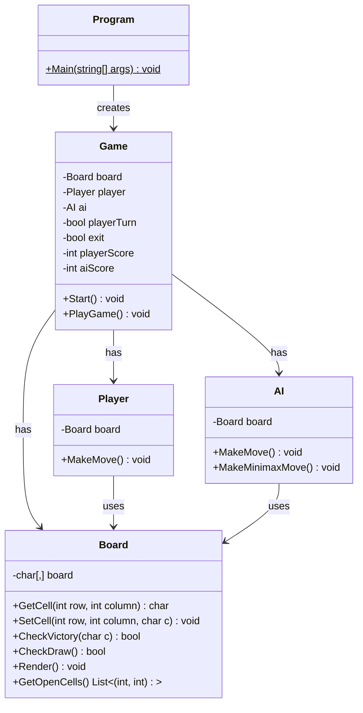

# Console Tic-Tac-Toe Game

A simple C# implementation of Tic-Tac-Toe playable in the console.

## Features

- Play against an AI opponent
- Two AI difficulty levels: 
  - Easy: Checks for win, then block, then random move
  - Hard: Unbeatable Minimax algorithm
- Score tracking
- Multiple rounds

## How to Run

1. Ensure you have .NET 5.0 or later installed
2. Clone the repository
3. Navigate to the project directory
4. Run `dotnet build`
5. Run `dotnet run`

## How to Play

- Use arrow keys to move
- Press Enter to place your mark
- Get three in a row to win
- Press Esc to exit

## Project Structure

- `Program.cs`: Entry point
- `Game.cs`: Manages game flow
- `Board.cs`: Represents the game board
- `Player.cs`: Handles player moves
- `AI.cs`: Implements AI opponent strategies

## UML Diagram

Enjoy the game!
